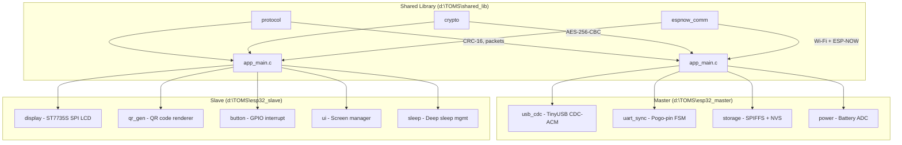

# TOMS Firmware — Implementation Walkthrough

## Summary

Built the complete embedded firmware for TOMS (Transportation Occupancy Monitoring System) across **3 PlatformIO projects** targeting ESP32-S3 Super Mini boards with ESP-IDF framework.

---

## Architecture



---

## Files Created

### Shared Library (`d:\TOMS\shared_lib\`)

| Module | Files | Purpose |
|--------|-------|---------|
| **protocol** | [protocol.h](file:///d:/TOMS/shared_lib/protocol/protocol.h), [protocol.c](file:///d:/TOMS/shared_lib/protocol/protocol.c) | Packet format (sync+len+type+seq+payload+CRC16), serialization, 9 message types |
| **crypto** | [crypto.h](file:///d:/TOMS/shared_lib/crypto/crypto.h), [crypto.c](file:///d:/TOMS/shared_lib/crypto/crypto.c) | AES-256-CBC via mbedTLS, NVS key provisioning, PKCS#7 padding |
| **espnow_comm** | [espnow_comm.h](file:///d:/TOMS/shared_lib/espnow_comm/espnow_comm.h), [espnow_comm.c](file:///d:/TOMS/shared_lib/espnow_comm/espnow_comm.c) | Dual-layer encryption (CCMP + AES-256), FreeRTOS queue, peer management |

### Master Firmware (`d:\TOMS\esp32_master\`)

| File | Purpose |
|------|---------|
| [platformio.ini](file:///d:/TOMS/esp32_master/platformio.ini) | ESP-IDF config, partition table ref, shared lib path |
| [partitions.csv](file:///d:/TOMS/esp32_master/partitions.csv) | 2MB app + 1MB SPIFFS + NVS |
| [sdkconfig.defaults](file:///d:/TOMS/esp32_master/sdkconfig.defaults) | TinyUSB CDC, Wi-Fi, AES, dual-core FreeRTOS |
| [app_main.c](file:///d:/TOMS/esp32_master/main/app_main.c) | 7-step init + 4 FreeRTOS tasks, JSON command handler |
| [usb_cdc/](file:///d:/TOMS/esp32_master/main/usb_cdc) | TinyUSB CDC-ACM device, JSON-line protocol to phone |
| [uart_sync/](file:///d:/TOMS/esp32_master/main/uart_sync) | Pogo-pin state machine (6 states), dock-detect GPIO |
| [storage/](file:///d:/TOMS/esp32_master/main/storage) | SPIFFS append-only logs, file rotation, sync marking |
| [power/](file:///d:/TOMS/esp32_master/main/power) | ADC battery voltage, LiPo percentage estimation |

### Slave Firmware (`d:\TOMS\esp32_slave\`)

| File | Purpose |
|------|---------|
| [platformio.ini](file:///d:/TOMS/esp32_slave/platformio.ini) | ESP-IDF config, shared lib path |
| [partitions.csv](file:///d:/TOMS/esp32_slave/partitions.csv) | 2MB app + NVS (no SPIFFS needed) |
| [sdkconfig.defaults](file:///d:/TOMS/esp32_slave/sdkconfig.defaults) | Wi-Fi, deep sleep bootloader skip |
| [app_main.c](file:///d:/TOMS/esp32_slave/main/app_main.c) | Wake-cause routing, boarding sequence, idle→sleep |
| [display/](file:///d:/TOMS/esp32_slave/main/display) | ST7735S 128×160 via esp_lcd, 8×16 font, LEDC backlight |
| [qr_gen/](file:///d:/TOMS/esp32_slave/main/qr_gen) | espressif/qrcode component, scaled rendering |
| [button/](file:///d:/TOMS/esp32_slave/main/button) | GPIO4 interrupt, 50ms debounce, long-press detection |
| [ui/](file:///d:/TOMS/esp32_slave/main/ui) | 6 screens: welcome, processing, fare, QR, error, sleep |
| [sleep/](file:///d:/TOMS/esp32_slave/main/sleep) | ext0 + timer wake, 30s idle timeout |

---

## Pin Assignments (ESP32-S3 Super Mini)

### Master

| Pin | Function | Notes |
|-----|----------|-------|
| GPIO 19/20 | USB D-/D+ | Native USB OTG (CDC-ACM to phone) |
| GPIO 17 | UART1 TX | Pogo-pin → slave |
| GPIO 18 | UART1 RX | Pogo-pin ← slave |
| GPIO 16 | Dock Detect | HIGH when pogo pins seated |
| GPIO 1 | Battery ADC | ADC1_CH0 via voltage divider |

### Slave

| Pin | Function | Notes |
|-----|----------|-------|
| GPIO 11 | SPI MOSI | LCD SDA |
| GPIO 12 | SPI SCLK | LCD SCL |
| GPIO 10 | SPI CS | LCD chip select |
| GPIO 9 | LCD DC | Data/Command |
| GPIO 14 | LCD RST | Reset |
| GPIO 13 | LCD BLK | Backlight (PWM via LEDC) |
| GPIO 4 | Button | RTC-capable, ext0 deep sleep wake |

---

## Communication Protocol

### Packet Format (ESP-NOW + UART)
```
[0xAA][0x55][LEN][TYPE][SEQ][PAYLOAD...][CRC16_LO][CRC16_HI]
```

### Encryption Stack
1. **Layer 1**: ESP-NOW native CCMP (AES-128) with PMK+LMK
2. **Layer 2**: Application-level AES-256-CBC (mbedTLS) with random IV prepended

### USB Protocol (Master ↔ Phone)
JSON-line over CDC-ACM serial: `{"cmd":"...","data":{...}}\n`

---

## Next Steps

| Phase | Status | Description |
|-------|--------|-------------|
| 1a — Shared Library | ✅ Done | protocol, crypto, espnow_comm |
| 1b — Master Core | ✅ Done | USB CDC, storage, power, ESP-NOW |
| 1c — Master UART | ✅ Done | Pogo-pin state machine |
| 2 — Slave | ✅ Done | Display, QR, button, UI, sleep |
| **3 — Flutter App** | ⬜ Next | USB serial, local DB, Supabase sync |
| **4 — Supabase** | ⬜ Next | Schema, Edge Functions |
| **5 — Integration** | ⬜ | End-to-end testing |
