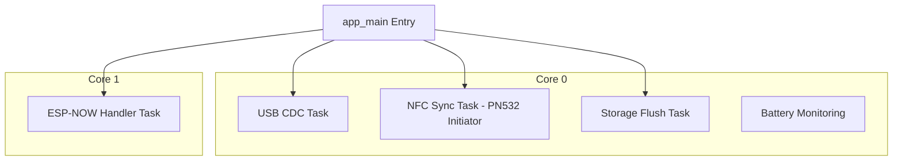
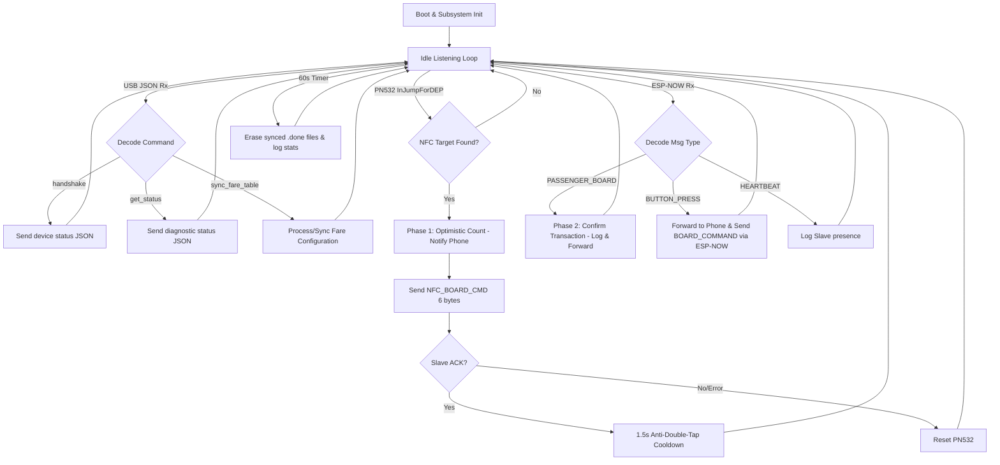

# TOMS Master Firmware Documentation

This document describes the firmware design, system architecture, pin assignments, software framework, APIs, program flow, and testing procedures for the TOMS (Transit Monitoring System) Master device.

## System Architecture

The Transit Monitoring System (TOMS) is designed to coordinate vehicle passenger check-ins, manage fare calculations, and store transactional records for public transit operations. The Master device is the central controller inside the vehicle:

1. Connects to the conductor's Android mobile device (running the Flutter app) via a USB CDC-ACM virtual serial interface (USB OTG).
2. Manages synchronization with Slave devices via two interfaces: **NFC-DEP peer-to-peer** (PN532 module, physical tap) or wirelessly (ESP-NOW).
3. Buffers and logs all check-in events in a local SPIFFS flash partition to prevent data loss in signal dead zones (offline-first architecture).
4. Monitors battery voltage using an integrated ADC channel to report power status.
5. Uses a **dictionary-based compact NFC exchange** — both Master and Slave share a pre-synced fare dictionary. NFC payloads carry only indices (6 bytes), not raw data (40 bytes).

```mermaid
graph TD
    subgraph Vehicle Cabin
        Master[ESP32-S3 Master Controller]
        Slave[ESP32-S3 Slave Unit]
    end
    
    subgraph Conductor UI
        Mobile[Android Flutter App]
    end
    
    subgraph Cloud Backend
        Supabase[(Supabase Database)]
    end
    
    Master -- USB OTG / CDC-ACM JSON-Line -- Mobile
    Master -- ESP-NOW 2.4 GHz AES-256 -- Slave
    Master -- PN532 NFC-DEP P2P I2C -- Slave
    Mobile -- HTTPS / Offline Sync -- Supabase
```

## Firmware Architecture

The Master firmware is built on top of the ESP-IDF RTOS environment, distributing tasks across the dual cores of the ESP32-S3 microcontroller to ensure real-time responsiveness.

* Core 0: Manages the USB CDC serial communication thread, the NFC P2P sync task (PN532 Initiator), SPIFFS storage operations, and battery monitoring.
* Core 1: Dedicated to the latency-critical ESP-NOW wireless network stack, processing wireless packets and driving immediate acknowledgments.



## Firmware Design

The firmware relies on an event-driven design pattern utilizing FreeRTOS queues and callbacks. Each peripheral driver (USB, NFC, ESP-NOW) is decoupled from the main coordination logic:
* Incoming USB packets from the conductor's phone trigger a receive callback which executes parsing routines.
* The NFC PN532 Initiator task polls for NFC-DEP targets every 250ms. On tap, the Slave's NFCID3 (containing its eFuse MAC) identifies it without a separate handshake.
* A **two-phase optimistic transaction** model is used: Phase 1 (NFC tap) increments the passenger counter immediately, Phase 2 (ESP-NOW PASSENGER_BOARD) confirms the transaction asynchronously.
* Wireless ESP-NOW messages are loaded into a thread-safe FreeRTOS queue and processed sequentially by a dedicated high-priority task.
* Transactions are cached in binary format inside SPIFFS files and written in blocks to extend flash endurance.
* A **fare dictionary** stored in NVS enables compact NFC payloads — only a fare_id index (1 byte) is transmitted instead of full fare/route data.

## Hardware Pin Assignment

The Master device is built on the ESP32-S3 Super Mini platform. The hardware pins are configured as follows:

| Interface | Pin Name | GPIO Pin | Pin Type | Description |
|---|---|---|---|---|
| NFC I2C | TOMS_NFC_I2C_SDA | GPIO 2 | Bidirectional | I2C data line to PN532 module |
| NFC I2C | TOMS_NFC_I2C_SCL | GPIO 3 | Output | I2C clock line to PN532 module |
| NFC IRQ | TOMS_NFC_IRQ_PIN | GPIO 4 | Input | PN532 interrupt (active LOW, tag ready) |
| Power | TOMS_BATTERY_ADC_CHANNEL | GPIO 1 (ADC1_CH0) | Analog Input | Measures battery voltage via a 0.5 voltage divider |
| USB OTG | Native USB D- | GPIO 19 | Bidirectional | Native USB signal for CDC-ACM virtual serial port |
| USB OTG | Native USB D+ | GPIO 20 | Bidirectional | Native USB signal for CDC-ACM virtual serial port |

## Software Framework Used

The firmware is developed using PlatformIO with the Espressif ESP-IDF software development framework (v5.0.0 or higher). This framework provides the underlying FreeRTOS kernel, virtual file system (VFS) interface, hardware abstraction drivers, and wireless protocol stacks.

## Required Libraries

The following dependencies are declared and loaded via the IDF Component Manager:

1. espressif/esp_tinyusb (version ^1): Configures the ESP32-S3's internal USB OTG controller into CDC-ACM device class mode.
2. mbedtls: Part of the ESP-IDF core library, providing hardware-accelerated cryptographic operations.
3. esp_wifi and esp_now: Core ESP-IDF libraries managing the RF driver, Wi-Fi Station layer, and raw connectionless frame transfers.
4. esp_spiffs and nvs_flash: Core ESP-IDF subsystems for file storage and key-value storage.
5. PN532 I2C driver: Custom shared library (`shared_lib/pn532/`) implementing the NXP PN532 NFC controller protocol over I2C.

## Protocol Used in Hardware Abstraction Layer

The system uses a custom application-level framing protocol (defined in `protocol.h`) to encapsulate messages sent over both NFC-DEP and wireless ESP-NOW:

* framing: `[Sync Word (0xAA55)][Length (1 byte)][Type (1 byte)][Sequence (1 byte)][Payload (0-240 bytes)][CRC-16-CCITT (2 bytes)]`
* NFC compact format: `[MSG_TYPE (1 byte)][fare_id (1 byte)][seat (1 byte)][timestamp (4 bytes)]` — 7 bytes total for boarding commands
* encryption: Wireless payloads (ESP-NOW) are encrypted with application-level AES-256-CBC using a key loaded from NVS, running on top of ESP-NOW's native AES-128 CCMP link encryption.
* fare dictionary: Both devices share a pre-synced lookup table in NVS indexed by `fare_id`. Only the index is transmitted over NFC.

## Program Flow Table

| Step | State/Action | Condition / Input | Output / State Transition |
|---|---|---|---|
| 1 | Boot Initialization | Power on / Reset | Initializes NVS, mounts SPIFFS, loads AES key, initializes Wi-Fi/ESP-NOW, configures USB CDC, initializes PN532 NFC, loads fare dictionary, reads ADC, launches FreeRTOS tasks. Transition to Idle Listening. |
| 2 | Idle Listening | Waiting for interrupts / messages | NFC task polls InJumpForDEP every 250ms, USB CDC stream is monitored, ESP-NOW event queue is processed. |
| 3 | USB Message Received | JSON command over USB CDC | Decodes JSON command. If `handshake`, replies with device info (MAC, battery, pending logs). If `get_status`, returns full diagnostics. If `sync_fare_table`, processes config. |
| 4 | NFC Tap Detection | PN532 InJumpForDEP succeeds | DEP link established. Slave NFCID3 = eFuse MAC extracted. Phase 1: Optimistic count — passenger counter incremented, phone notified with `nfc_tap` event. |
| 5 | NFC Board Command | DEP link active | Sends compact NFC_BOARD_CMD (fare_id + seat + timestamp, 6 bytes) via InDataExchange. Slave responds with NFC_ACK. Link released. Cooldown (1.5s anti-double-tap). |
| 6 | ESP-NOW Confirmation | Receives TOMS_MSG_PASSENGER_BOARD wirelessly | Phase 2: Transaction confirmed. Logs passenger event to SPIFFS. Forwards confirmed transaction to phone via USB. |
| 7 | ESP-NOW Button Event | Receives TOMS_MSG_BUTTON_PRESS wirelessly | Transmits `button_press` event to Mobile via USB. Sends wireless ACK. Dispatches TOMS_MSG_BOARD_COMMAND back to the sender Slave MAC. |
| 8 | Periodic Storage Flush | 60 seconds timer elapsed | Storage task runs, clears old synced transaction files (`.done`), and logs active memory usage stats. |

## Program Flowchart



## APIs in the Codebase

### Implemented APIs

* `int toms_storage_init(void)`: Mounts VFS SPIFFS and initializes the NVS flash interface.
* `bool toms_storage_log_event(const toms_passenger_event_t *event)`: Appends a transaction binary packet to the active SPIFFS file.
* `int toms_storage_get_pending_count(void)`: Returns the number of unsynced transaction files currently cached.
* `bool toms_storage_read_pending(uint8_t *buf, size_t buf_size, size_t *out_len, char *fname)`: Reads an unsynced transaction file.
* `bool toms_storage_mark_synced(const char *fname)`: Renames a file by changing its extension to `.done`.
* `void toms_storage_cleanup(void)`: Iterates over the storage partition and deletes all files marked `.done`.
* `int toms_crypto_init(void)`: Loads the AES-256 key from NVS.
* `bool toms_crypto_encrypt(...)`: Encrypts a payload buffer with AES-256-CBC.
* `bool toms_crypto_decrypt(...)`: Decrypts an IV-prefixed AES-256-CBC ciphertext buffer.
* `int toms_espnow_init(const uint8_t *pmk)`: Initializes Wi-Fi in Station mode and sets up ESP-NOW.
* `bool toms_espnow_send(const uint8_t *dst_mac, const toms_packet_t *pkt)`: Encrypts, serializes, and transmits a wireless packet.
* `int toms_usb_cdc_init(void)`: Configures the USB controller and CDC descriptors.
* `int toms_usb_cdc_send(const char *json)`: Pushes a JSON string to the mobile app.
* `int toms_nfc_sync_init(void)`: Initializes PN532 over I2C as NFC-DEP Initiator.
* `void toms_nfc_sync_set_tap_cb(toms_nfc_tap_cb_t cb)`: Registers callback for NFC tap detection.
* `void toms_nfc_sync_set_fare(uint8_t fare_id, uint8_t seat)`: Sets active fare for next NFC tap.
* `void toms_nfc_sync_task(void *arg)`: NFC Initiator polling task (FreeRTOS).
* `toms_nfc_state_t toms_nfc_sync_get_state(void)`: Returns current NFC state.
* `esp_err_t toms_fare_dict_load(toms_fare_dict_t *dict)`: Loads fare dictionary from NVS.
* `const toms_fare_entry_t *toms_fare_dict_lookup(const toms_fare_dict_t *dict, uint8_t fare_id)`: Looks up a fare entry by ID.
* `int toms_power_init(void)`: Configures the ADC1 peripheral for battery readings.
* `uint32_t toms_power_get_battery_mv(void)`: Returns raw battery voltage in millivolts.
* `uint8_t toms_power_get_battery_pct(void)`: Returns battery state of charge percentage.

### Planned to be Implemented

* `bool toms_storage_set_fare_table(const uint8_t *data, size_t len)`: Planned API to persist updated route pricing tables received from the mobile app to NVS.
* `bool toms_storage_get_fare_table(uint8_t *buf, size_t max_len, size_t *out_len)`: Planned API to read pricing tables from NVS for syncing to Slaves.
* `void toms_power_enter_light_sleep(void)`: Planned power-saving API.

## Planned / Implemented User Acceptance Testing (UAT)

1. USB OTG Communication: Conductor connects their Android phone running the Flutter app. The Master must establish a virtual serial link, complete the handshake within 1.5 seconds, and report its battery percentage and file counters.
2. NFC Tap Boarding: Conductor taps a Slave device against the Master's PN532 antenna. The Master must detect the NFC-DEP link, read the Slave's UID from NFCID3, send a compact BOARD_CMD (6 bytes), receive ACK, and notify the phone with an optimistic `nfc_tap` event — all within 300ms.
3. ESP-NOW Confirmation: After the Slave processes the boarding (shows fare, renders QR), it sends PASSENGER_BOARD via ESP-NOW. The Master must confirm the transaction and forward it to the phone.
4. Offline Logging Validation: Disconnect the mobile device. Trigger 10 boarding events. The Master must successfully write all 10 records to SPIFFS. Reconnect the mobile device; the Master must sync the 10 stored records.
5. AES-256 Payload Security: Capture ESP-NOW traffic using an external sniffer. Payload content must be fully encrypted.

## Testing and Validation (Hardware Focus: Module & Power Testing)

### Power Measurement and Calibrations
* Battery Monitor Voltage Divider: The hardware employs a 100k ohm / 100k ohm (0.5 ratio) resistor divider to bring battery voltage (3.0V - 4.2V) within the ESP32-S3's ADC input range.
* ADC Calibration: The codebase utilizes `esp_adc_cal_characterize` to configure raw ADC counts against factory-fused eFuse calibration values.
* Threshold Validation: The firmware implements a low battery warn threshold at 3300mV (~20% capacity) and a critical shutdown threshold at 3100mV.

### Module Interface Verification
* PN532 I2C Communication: The I2C bus operates at 400 kHz. IRQ pin (GPIO 4) is used for zero-latency response detection. The PN532 firmware version is verified on every boot.
* NFC-DEP Link Timing: At 424 kbps, the NFC data exchange (6-byte command + 1-byte ACK) takes under 1ms on the RF layer. Total tap time is ~100-150ms, dominated by DEP link setup.
* RF Verification: Wi-Fi output power is adjusted to ensure reliable ESP-NOW operation within a 15-meter vehicle cabin radius.

## Potential TODOs in the Codebase

1. Parsing of JSON Fare Tables: Integrate `cjson` parser inside `usb_cdc.c` / `app_main.c` to parse fare arrays received over USB and update the fare dictionary.
2. NVS Storage for Fare Tables: Implement `toms_fare_dict_save()` to persist fare dictionaries received from the phone and sync to Slaves.
3. Secure Key Provisioning: Establish a protocol command to provision the AES-256 key via USB CDC on assembly.
