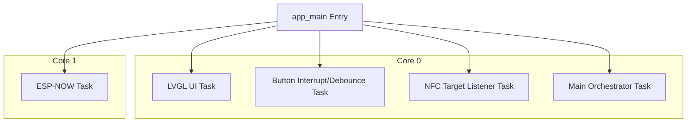
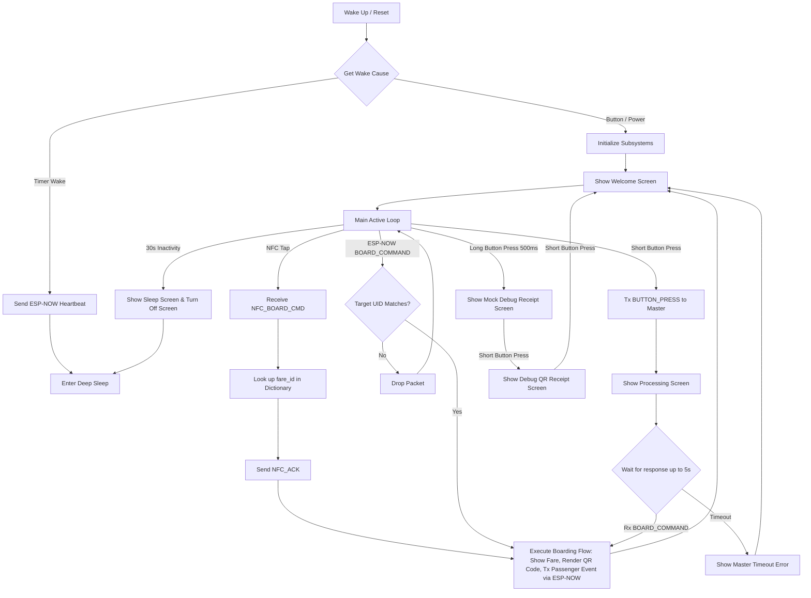

# TOMS Slave Firmware Documentation

This document describes the firmware design, system architecture, pin assignments, software framework, APIs, program flow, and testing procedures for the TOMS (Transit Monitoring System) Passenger Slave device.

## System Architecture

The Passenger Slave device acts as the interface for passengers in the vehicle cabin. Its main responsibilities are:

1. Displaying welcoming prompts, fare details, seat numbers, and transaction status screens.
2. Generating and rendering high-contrast QR codes on the screen that act as passenger check-in receipts.
3. Receiving manual check-in requests via a physical wake-up button.
4. Communicating with the Master device via **NFC-DEP peer-to-peer** (PN532 module, physical tap) or wirelessly (ESP-NOW).
5. Minimizing battery power consumption using aggressive deep sleep modes, waking up only upon button presses or timer-based heartbeats.
6. Using a **fare dictionary** to expand compact NFC commands into full boarding data locally.

```mermaid
graph TD
    subgraph Vehicle Cabin
        Master[ESP32-S3 Master Controller]
        Slave[ESP32-S3 Slave Unit]
    end
    
    subgraph Slave Subsystems
        Button[Wake Button / Interrupt]
        TFT[ST7735S TFT Screen]
        LVGL[LVGL UI Engine]
        PN532_S[PN532 NFC Module - Target]
    end
    
    Master -- ESP-NOW Wireless / NFC-DEP P2P -- Slave
    Slave --> Button
    Slave --> TFT
    Slave --> LVGL
    Slave --> PN532_S
```

## Firmware Architecture

The Slave firmware is structured around a passive, master-driven architecture designed to minimize active runtime and maximize battery life. It divides operations into dedicated FreeRTOS tasks pinned to the ESP32-S3's dual cores:

* Core 0: Executes low-priority and user-interface tasks: LVGL timer ticks, physical button debouncing, NFC Target listener, and the main coordination state machine.
* Core 1: Runs the latency-sensitive wireless ESP-NOW handler task to process incoming commands and send ACKs.



## Firmware Design

The firmware is designed around a passive state-machine:
* Sleep Mode: Microcontroller sits in deep sleep (current consumption under 15 microamps). It wakes via an ext0 RTC interrupt on the button or a timer.
* Timer Wake: Wakes every 5 minutes, transmits an ESP-NOW heartbeat containing its battery/status, and immediately sleeps.
* Active Mode: Wakes on button press. Initializes peripherals (including PN532 NFC as Target), starts a 30-second idle timer, and shows the Welcome screen.
* NFC Tap Handling: The PN532 waits in Target mode (TgInitAsTarget, DEP-only, IRQ-driven). When the Master taps, it receives a compact NFC_BOARD_CMD (fare_id + seat + timestamp), looks up the fare_id in its local dictionary, and triggers the boarding flow.
* Transaction Handling: Displays processing screen, fare details, and renders the QR receipt. Sends a `PASSENGER_BOARD` confirmation via ESP-NOW, and returns to Welcome.

## Hardware Pin Assignment

The Slave is implemented on the ESP32-S3 Super Mini platform. The hardware pins are configured as follows:

| Interface | Pin Name | GPIO Pin | Pin Type | Description |
|---|---|---|---|---|
| NFC I2C | TOMS_NFC_I2C_SDA | GPIO 2 | Bidirectional | I2C data line to PN532 module |
| NFC I2C | TOMS_NFC_I2C_SCL | GPIO 3 | Output | I2C clock line to PN532 module |
| NFC IRQ | TOMS_NFC_IRQ_PIN | GPIO 5 | Input | PN532 interrupt (active LOW) |
| SPI Display | TOMS_LCD_PIN_SDA | GPIO 11 | Output | SPI Master Out Slave In (MOSI) |
| SPI Display | TOMS_LCD_PIN_SCK | GPIO 12 | Output | SPI Clock (SCK) |
| SPI Display | TOMS_LCD_PIN_CS | GPIO 10 | Output | Chip Select (Active LOW) |
| SPI Display | TOMS_LCD_PIN_A0 | GPIO 9 | Output | Data / Command Selection (A0) |
| SPI Display | TOMS_LCD_PIN_RESET | GPIO 8 | Output | LCD Hardware Reset |
| SPI Display | TOMS_LCD_PIN_LED | GPIO 13 | Output | Backlight Control |
| Push Button | TOMS_BUTTON_PIN | GPIO 4 | Input (RTC) | Hardware push button with pull-up. Active LOW (ext0 wake) |

## Software Framework Used

The firmware is developed using PlatformIO with the Espressif ESP-IDF software development framework (v5.0.0 or higher).

## Required Libraries

The following dependencies are loaded via the IDF Component Manager:

1. teriyakigod/esp_lcd_st7735 (version *): Sub-driver for the ST7735 SPI LCD panel interface.
2. espressif/qrcode (version *): Lightweight QR code encoding engine.
3. lvgl/lvgl (version ~8.3.0): Light and Versatile Graphics Library for rendering layouts and animations.
4. ESP-IDF Core: Includes FreeRTOS, ESP-NOW, Wi-Fi driver, NVS flash interface, and mbedtls for AES-256-CBC decryption.
5. PN532 I2C driver: Custom shared library (`shared_lib/pn532/`) for NFC-DEP Target mode communication.

## Protocol Used in Hardware Abstraction Layer

The communications HAL layer uses two protocol formats:
* ESP-NOW framing: `[Sync Word (0xAA55)][Length (1 byte)][Type (1 byte)][Sequence (1 byte)][Payload (0-240 bytes)][CRC-16-CCITT (2 bytes)]`
* NFC compact format: `[MSG_TYPE (1 byte)][fare_id (1 byte)][seat (1 byte)][timestamp (4 bytes)]` — 7 bytes total
* fare dictionary: Both devices share a pre-synced lookup table in NVS. The Slave expands `fare_id` into full `toms_board_command_t` locally.
* encryption: ESP-NOW payloads are encrypted via AES-256-CBC.
* display interface: SPI serial bus operating up to 20 MHz.
* button interface: RTC GPIO input configured with a callback on negative edge triggers.

## Program Flow Table

| Step | State/Action | Condition / Input | Output / State Transition |
|---|---|---|---|
| 1 | Boot Wake | Power-on, Button, or Timer interrupt | Reads RTC registers. If wake cause is timer, sends heartbeat and sleeps. If button / power-on, initialises subsystems and displays Welcome screen. |
| 2 | Active Welcome Screen | Subsystems initialised | Displays "Tap or Press to Board". PN532 enters Target mode (TgInitAsTarget). Resets 30-second idle timer. |
| 3 | NFC Tap (Primary) | Master taps PN532 — TgInitAsTarget activates | Receives NFC_BOARD_CMD (6 bytes). Looks up fare_id in dictionary. Sends NFC_ACK. Triggers execute boarding process. |
| 4 | Command RX (ESP-NOW) | Receives TOMS_MSG_BOARD_COMMAND on ESP-NOW | Validates target UID. If matched, sends ACK and triggers execute boarding process. |
| 5 | Boarding Execution | Valid command payload | Shows "Processing..." screen (0.5s), displays Fare and Seat screen (3.0s), generates and renders QR Receipt screen (8.0s). |
| 6 | Boarding Completion | Renders QR screen | Sends TOMS_MSG_PASSENGER_BOARD packet to Master via ESP-NOW (Phase 2 confirmation). Re-displays Welcome screen. Resets idle timer. |
| 7 | Manual Button Request | Button pressed (short press) | Transmits TOMS_MSG_BUTTON_PRESS to Master via ESP-NOW. Shows "Processing..." screen. Waits up to 5s for response. |
| 8 | Button Request Response | Received response within 5s | Executes boarding process immediately. |
| 9 | Button Request Timeout | No response within 5s | Displays "Master Timeout" error screen (3.0s) and returns to Welcome screen. |
| 10 | Debug Long Press | Button long-pressed for 500ms | Enters Debug mode. Generates and displays a mock printable receipt. |
| 11 | Debug Screen Progression | Short button press in debug receipt screen | Generates receipt string and renders the equivalent QR code. |
| 12 | Debug Exit | Short button press in debug QR screen | Exits debug mode, returns to Welcome screen. |
| 13 | Idle Timeout Sleep | 30 seconds of inactivity | Displays Sleep screen (blacks screen, turns off LCD backlight) and enters deep sleep. |

## Program Flowchart



## APIs in the Codebase

### Implemented APIs

* `int toms_display_init(void)`: Configures SPI bus pins, registers display panel driver, initializes LVGL framework buffers.
* `void toms_display_set_backlight(uint8_t brightness)`: Adjusts backlight brightness level using LEDC PWM.
* `int toms_button_init(void)`: Configures button GPIO with internal pull-up and attaches ISR callback on falling edge.
* `void toms_button_set_callback(toms_button_cb_t cb)`: Registers the application event handler for button transitions.
* `void toms_button_task(void *arg)`: FreeRTOS task handling button state debouncing and long-press detection.
* `void toms_sleep_init(void)`: Configures ext0 wake-up sources and RTC wake timer intervals.
* `void toms_sleep_enter(void)`: Disables display backlight and triggers deep sleep mode.
* `toms_wake_cause_t toms_sleep_get_wake_cause(void)`: Returns the enum mapping for the wake-up trigger.
* `void toms_ui_show_welcome(void)`: Switches to Welcome prompt screen.
* `void toms_ui_show_processing(void)`: Displays spinner indicating master communication.
* `void toms_ui_show_fare(const char *route_name, uint16_t fare_centavos, uint8_t seat_number)`: Renders boarding details.
* `void toms_ui_show_qr(const char *qr_data)`: Renders QR code receipt.
* `int toms_slave_nfc_init(void)`: Initializes PN532 over I2C as NFC-DEP Target. Loads eFuse MAC into NFCID3. Loads fare dictionary from NVS.
* `void toms_slave_nfc_set_board_cb(toms_slave_nfc_board_cb_t cb)`: Registers callback for boarding commands received via NFC tap.
* `void toms_slave_nfc_task(void *arg)`: NFC Target listener task. Waits for Master tap (IRQ-driven), receives compact command, expands via fare dictionary, fires callback.
* `esp_err_t toms_fare_dict_load(toms_fare_dict_t *dict)`: Loads fare dictionary from NVS.
* `const toms_fare_entry_t *toms_fare_dict_lookup(const toms_fare_dict_t *dict, uint8_t fare_id)`: Fare entry lookup by ID.

### Planned to be Implemented

* `bool toms_config_load_from_nvs(void)`: Planned API to read stored route IDs and seat numbers on startup.
* `bool toms_config_save_to_nvs(const toms_config_payload_t *cfg)`: Planned API to update configuration parameters.
* `bool toms_fare_table_save_to_nvs(...)`: Planned API to store fare table updates in NVS.

## Planned / Implemented User Acceptance Testing (UAT)

1. NFC Tap Boarding: Master taps the Slave. The Slave must receive the compact NFC_BOARD_CMD, look up the fare in its dictionary, display the fare screen, render the QR code, send ESP-NOW confirmation, and return to Welcome. Total time from tap to fare screen: < 500ms.
2. Local Debug Receipt: Long press the physical button for 500ms. The display must render the mock receipt page. Click the button; it must transition to the QR code. Click again; it must return to the Welcome screen.
3. Anti-fraud UID Validation: Send a wireless `BOARD_COMMAND` with a mismatched target UID. The Slave must silently discard the command and remain in Welcome state.
4. Button-triggered Boarding: Click the button on the Welcome screen. The device must send a button press packet and display "Processing...". The Master must reply, and the Slave must transition to boarding screens.
5. Inactivity Sleep: Leave the Slave untouched. The screen backlight must turn off and the unit enter deep sleep after 30 seconds.

## Testing and Validation (Hardware Focus: Module & Power Testing)

### Power Measurement and Calibrations
* Active Consumption: Peripherals (TFT LCD backlight, CPU running at 240 MHz, PN532 NFC) consume approximately 70 - 90 mA.
* Deep Sleep Optimization: CPU cores are powered down, Wi-Fi RF is disabled, LCD is put into sleep mode, PN532 enters power-down. Deep-sleep current under 15 microamps.
* Wake-up Calibrations: RTC controller detects button presses (GPIO 4 falling edge) via `esp_sleep_enable_ext0_wakeup`.

### Module Interface Verification
* SPI LCD Clock Rate: The SPI bus operates at 20 MHz.
* PN532 I2C Communication: I2C bus at 400 kHz on GPIO 2 (SDA) / GPIO 3 (SCL). IRQ on GPIO 5 for zero-latency response detection.
* NFC-DEP Target Mode: PN532 configured for DEP-only mode. NFCID3 embeds the Slave's eFuse MAC for identification during link setup.
* Debouncing Calibration: A debouncing task (50ms interval) reads raw pin values and verifies stable levels.

## Potential TODOs in the Codebase

1. Load configurations from NVS: Implement NVS loading to configure default variables like seat assignments on startup.
2. Persist Fare Tables: Implement logic to save received fare tables locally to NVS via `toms_fare_dict_save()`.
3. Dynamic Backlight Timeout: Dynamically scale down backlight brightness after 15 seconds of idle time before entering sleep.
