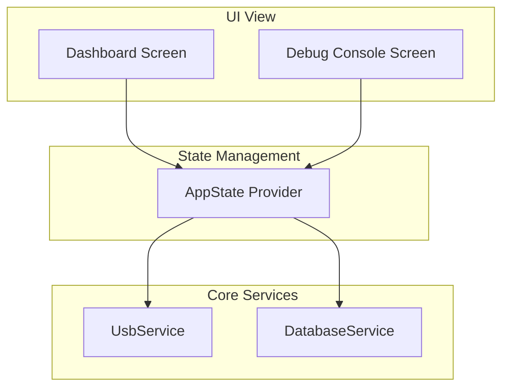
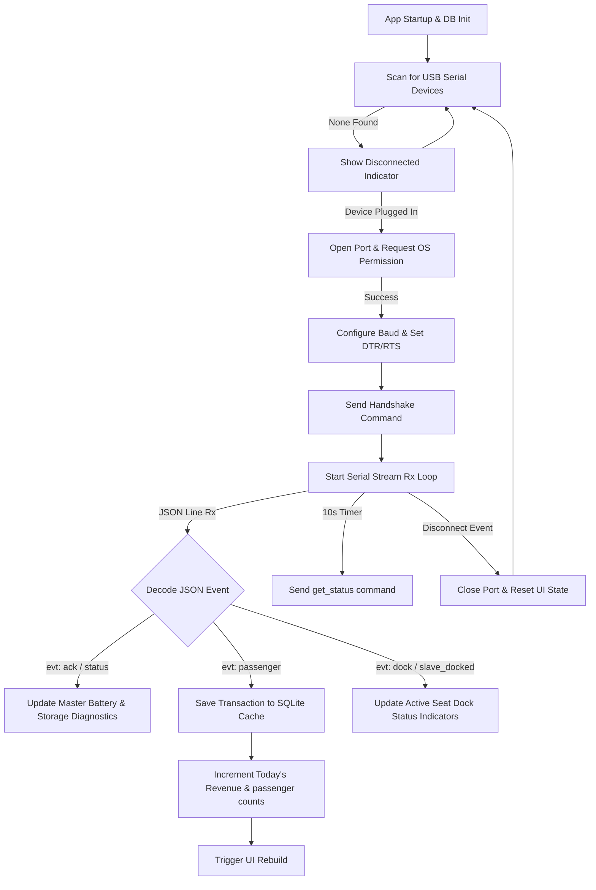

# TOMS Mobile Application Documentation

This document describes the application design, architecture, database configurations, APIs, user interface, program flow, and testing procedures for the TOMS (Transit Monitoring System) Flutter Mobile Application.

## System Architecture

The TOMS Mobile Application is a Flutter-based tablet/mobile app designed to run on the conductor's Android device. It acts as the bridge between the physical vehicle hardware (Master ESP32-S3) and the cloud database:

1. Establishes a local physical link with the Master controller using an Android USB OTG connection, operating over a virtual serial CDC-ACM interface.
2. Serves as the real-time operator interface, showing vehicle occupancy, active routes, current passenger records, and battery status.
3. Provides an offline-first transaction database, caching passenger boarding logs locally when mobile signals are unavailable.
4. Orchestrates synchronisation queues to push cached passenger records to the Supabase cloud backend when a cellular/Wi-Fi connection is detected.

```mermaid
graph TD
    subgraph Conductor Mobile
        UI[Flutter Dashboard UI]
        AppState[AppState Provider]
        Sqlite[(SQLite Local Cache)]
        UsbService[UsbService CDC-ACM]
    end
    
    subgraph Vehicle Hardware
        Master[ESP32-S3 Master]
    end
    
    subgraph Cloud
        Supabase[(Supabase Backend)]
    end
    
    UsbService -- USB OTG / JSON-Line -- Master
    UsbService --> AppState
    AppState --> UI
    AppState --> Sqlite
    AppState -- HTTPS Sync -- Supabase
```

## Application Architecture

The mobile application utilizes a clean Model-View-Service architecture built around the Provider state-management framework to achieve separation of concerns:

* View Layer: Built with Material 3, displaying Dashboard, passenger details, and diagnostic status screens.
* Service Layer: Decoupled singletons managing background hardware tasks:
  * `UsbService`: Manages USB lifecycles, parses incoming JSON frames, and queues commands.
  * `DatabaseService`: Manages SQLite operations, schema upgrades, and local query execution.
* State Orchestrator (`AppState`): Connects service outputs, writes logs to SQLite, updates daily statistics, and notifies UI components to trigger redraws.



## Application Design

The app implements an offline-first design:
* Serial Parser: Listens to raw streams from the USB port, reconstructing chunks into text strings using a newline delimiter to feed the JSON decoder.
* Local Caching: Ingests decoded passenger packets, serialises them into local SQLite tables, updates memory variables, and immediately confirms processing.
* Heartbeat Monitoring: Runs a periodic 10-second timer to request status checks (battery, logs, connection states) from the Master device.
* Cloud Sync: Designed as an asynchronous background worker that pulls unsynced records from the SQLite database, batches them, uploads them to the cloud backend, and updates local records to flagged states.

## Hardware Pin Assignment

Because the mobile application is a software layer running on commercial Android hardware, it does not directly manage low-level GPIO pin configurations. Instead, it accesses hardware interfaces through:
* Interface: USB Controller on the Android SoC.
* Protocol Mode: Configured in USB Host Mode via the Android SDK (`android.hardware.usb.host` feature).
* Physical Connection: Android USB Type-C (or Micro-USB) interface connected to the Master ESP32-S3 via a USB OTG (On-The-Go) cable or adapter.

## Software Framework Used

The mobile application is developed using the Flutter SDK framework (Dart programming language), targeting the Android platform (Android 5.0 / API Level 21 and higher).

## Required Libraries

The following dependencies are declared inside `pubspec.yaml`:

1. usb_serial (version ^0.5.1): Wraps Android USB host APIs to discover, open, and communicate with USB-to-serial chips without requiring device root access.
2. provider (version ^6.1.2): Standard state-management container used to inject services and rebuild UI widgets.
3. sqflite (version ^2.4.2): SQLite database plugin for local structured data caching.
4. path (version ^1.9.1): Standard library providing cross-platform file system path helpers.
5. intl (version ^0.20.2): Implements formatting for dates, times, and currencies.
6. google_fonts (version ^6.2.1): Tailored typography rendering.
7. lucide_icons (version ^0.257.0): Modern UI iconography.

## Protocol Used in Hardware Abstraction Layer

The application-level HAL protocol uses newline-delimited JSON objects transmitted over the USB virtual serial port at 115200 baud (8 data bits, 1 stop bit, no parity, DTR/RTS enabled):

* Conductor Phone to Master Commands:
  * Handshake: `{"cmd":"handshake"}`
  * Get Status: `{"cmd":"get_status"}`
  * Sync Fare Table: `{"cmd":"sync_fare_table"}` (includes pricing parameters)
* Master to Conductor Phone Events:
  * Acknowledgment: `{"evt":"ack", ...}` (includes battery percentage, storage space, and pending file counters)
  * Status Diagnostics: `{"evt":"status", ...}` (detailed hardware status counters)
  * Passenger Check-in: `{"evt":"passenger", "timestamp":..., "boarding_type":..., "fare_centavos":..., "seat":..., "route":..., "passenger_id":...}`
  * Docking Connection: `{"evt":"dock", "state":"connected"|"disconnected"}`
  * Slave Dock Authentication: `{"evt":"slave_docked", "uid":..., "seat":...}`
  * Error Warning: `{"evt":"error", "msg":...}`

## Program Flow Table

| Step | State/Action | Condition / Input | Output / State Transition |
|---|---|---|---|
| 1 | Boot Initialization | App launch | Instantiates SQLite services, registers providers, launches UI dashboard. Triggers automatic USB scanning loop. |
| 2 | USB Device Connected | Master USB cable plugged in | Detects device, prompts Android OS for USB permissions, opens serial port, configures 115200 baud, transmits `handshake` command. Updates state to Connected. |
| 3 | Handshake Processing | Receives `ack` event over USB | Extracts Master details (eFuse MAC, battery percentage, unsynced files counter). Updates dashboard indicator. |
| 4 | Diagnostic Heartbeat | 10 seconds timer ticks | Transmits `get_status` command to Master. Updates battery indicators and storage statistics upon return. |
| 5 | Passenger Boarding | Receives `passenger` event over USB | Parses passenger parameters, logs event into `passenger_logs` table in SQLite, increments today's totals, triggers UI redraw. |
| 6 | Slave Mated to Dock | Receives `slave_docked` event over USB | Logs the Slave's unique hardware UID and seat number to the dashboard, indicating active docking calibration. |
| 7 | Dock State Disconnection | Receives `dock` state disconnected | Updates UI dashboard dock indicator to inactive. |
| 8 | UI Refresh Trigger | AppState calls `notifyListeners()` | Triggers rebuilds of the Dashboard Screen metrics (Revenue, Passenger counts, Recent Log lists). |
| 9 | Database Query | User opens transactions view | Fetches transaction logs from the local SQLite table sorted by timestamp descending. |
| 10 | Cloud Sync (Planned) | Internet connectivity detected | Fetches unsynced records (synced = 0) from SQLite, pushes them in batches to Supabase backend, marks local rows as synced. |

## Program Flowchart



## APIs in the Codebase

### Implemented APIs

* `Future<bool> UsbService.connect()`: Scans available USB controllers on Android. If matching chips are found, requests OS permissions, opens the stream, applies serial properties, and registers listeners.
* `void UsbService.disconnect()`: Closes streams, cancels timers, releases serial ports, and resets variables.
* `Future<void> UsbService.sendCommand(String cmd, [Map<String, dynamic>? extra])`: Formats a command string, serializes it to a JSON-line byte array, and writes it to the USB TX endpoint.
* `Future<void> UsbService.requestStatus()`: Convenience command that sends `get_status` to the Master.
* `Future<Database> DatabaseService.database`: Getter that initializes the SQLite database file (`toms.db`) if not already opened.
* `Future<int> DatabaseService.insertLog(PassengerLog log)`: Inserts a passenger record row into the `passenger_logs` table.
* `Future<List<PassengerLog>> DatabaseService.getAllLogs({int limit = 50})`: Queries the latest transactions cached in the database.
* `Future<List<PassengerLog>> DatabaseService.getUnsyncedLogs()`: Queries rows where the `synced` flag is set to 0.
* `Future<void> DatabaseService.markSynced(List<int> ids)`: Updates rows in batch, setting the `synced` flag to 1.
* `Future<int> DatabaseService.getTodayRevenue()`: Returns the sum of centavos collected today since 12:00 AM.
* `Future<int> DatabaseService.getTodayPassengerCount()`: Returns the count of passenger check-ins logged since 12:00 AM.
* `Future<void> AppState.connectUsb()`: UI wrapper to trigger USB detection.
* `Future<void> AppState.refreshData()`: Refreshes cached memory variables from SQLite for UI panels.

### Planned to be Implemented

* `Future<void> SyncService.synchronizeWithCloud()`: Planned API to query local unsynced records, push batches to Supabase, and mark them as synced upon success.
* `Future<bool> SyncService.checkConnectivity()`: Planned API to monitor Wi-Fi/Cellular connectivity status.
* `Future<void> UsbService.syncFareTable(List<dynamic> fares)`: Planned API to send new fare configs to the Master.

## Planned / Implemented User Acceptance Testing (UAT)

1. USB OTG Connection Autodetect: Connect the Android phone to the Master ESP32-S3. The app must prompt for USB permissions automatically, connect without crashing, complete the handshake, and display battery metrics.
2. Real-time Dashboard Update: Trigger a passenger check-in on a Slave device. The transaction must appear in the Recent Transactions list on the mobile screen within 500ms, and today's total revenue and passengers must increment.
3. Offline Caching Verification: Disconnect the phone from the internet. Log 5 transactions. Verify in the debug view that logs are successfully saved to SQLite and marked unsynced. Reconnect the internet and verify they are successfully pushed.
4. Serial Hot-Plug Resilience: Unplug the USB cable while the app is active. The dashboard must immediately update to "Disconnected". Re-plug the cable; the connection must recover automatically.

## Testing and Validation (Hardware Focus: Module & Power Testing)

### USB Power Delivery Validation
* OTG Power Constraints: Android devices supply up to 500mA at 5V over USB OTG. The Master ESP32-S3 module, running at maximum RF transmission levels, draws between 150mA and 250mA. This falls within OTG limits, ensuring stable operation without causing phone brownouts or restarts.
* Battery Voltage Verification: The app monitors the battery percentage of the Master device, alerting the conductor with a visual warning when the Master battery falls below 20% (voltage drops below 3300mV).

### Module Interface Verification
* Serial Baud Rate Tuning: Testing validates that transmitting serialized JSON frames at 115200 baud does not saturate the serial controller, maintaining low latency and preventing buffer overflows.

## Potential TODOs in the Codebase

1. Supabase Backend Sync: Implement the planned `SyncService` to sync cached transactions with the cloud database.
2. JSON Fare Table Sync: Add UI forms on the screen to let conductors edit route fares and serialize them to the Master via the planned `syncFareTable` interface.
3. Local Database Encryption: Implement database encryption (e.g., SQLCipher) to secure passenger identifiers cached in the local database.
